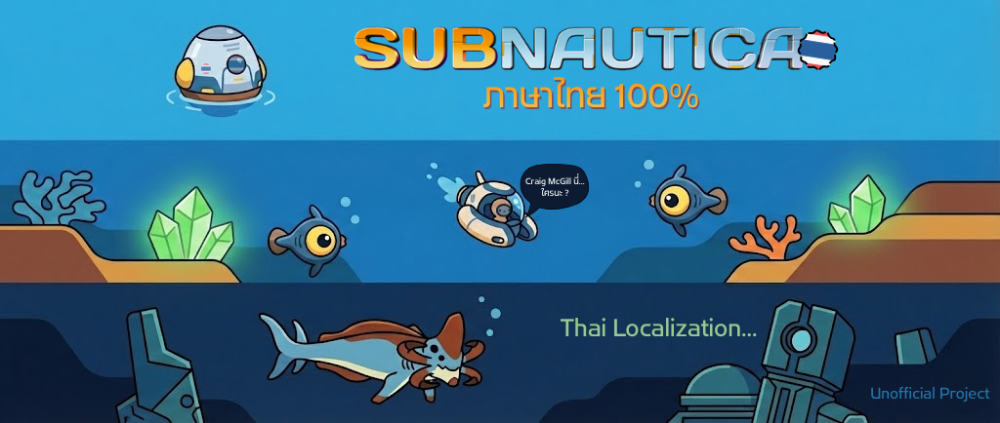

# Subnautica Thai Localization (Subnautica ภาษาไทย 100%)

[](https://www.nexusmods.com/subnautica/mods/2892)
[](https://www.python.org/)
[](https://github.com/astral-sh/uv)

Repository นี้เป็น Source Code สำหรับโปรเจกต์แปลภาษาไทยของเกม **Subnautica**
ภาคแรก แปลมือ + AI ช่วยในการแปลและเกลาภาษา แต่มีการตรวจสอบและแก้ไขโดยมนุษย์เพื่อความถูกต้องในทุกๆ บรรทัด (พิถีพิถัน)

สามารถดาวน์โหลดมอดเวอร์ชันพร้อมใช้งานได้ที่ 

[](https://www.nexusmods.com/subnautica/mods/2892)

สำรอง:

[](https://drive.google.com/drive/folders/1tZ9Zq_m-CLiZdpOEon8qrfEmUMFf2zBy?usp=drive_link)

---

## 📺 วิธีการติดตั้ง (Installation)

ดูวิดีโอสอนการติดตั้งและรีวิวได้ที่นี่:
<div align="center">

[](https://www.youtube.com/watch?v=nvtfsFqSS6Y)

*(คลิกที่รูปเพื่อดูวิดีโอ)*
</div>

---

## 🛠️ การพัฒนา (Development)

📖 อ่านคู่มือฉบับเต็มได้ที่: [Translation Guide](docs/translation_guide.md)

โปรเจกต์นี้ใช้ **[uv](https://github.com/astral-sh/uv)** ในการจัดการ Environment

### Setup

1.  Clone repository นี้
    ```bash
    git clone https://github.com/Onyx-Nostalgia/subnautica-th.git
    ```
3.  ติดตั้ง Dependencies:
    ```bash
    uv sync
    ```
4.  รันโปรแกรมหลัก:
    ```bash
    uv run main.py
    ```
5.  รันเครื่องมือแก้ไขคำแปล:
    ```bash
     uv run streamlit run editor.py 
     ```

### โครงสร้างโปรเจกต์

*   `main.py`: ไฟล์หลักสำหรับการรันโปรแกรม
*   `editor.py`: เครื่องมือสำหรับแก้ไขคำแปล
*   `agent/`: AI Agent ที่ช่วยในการแปลและเกลาภาษา
*   etc. อำนวยความสะดวกอื่นๆ

---

## ⚠️ Disclaimer (ข้อควรระวัง)

*   โปรเจกต์นี้เป็นผลงานที่จัดทำขึ้นโดย Fan-made เพื่อการศึกษาและเพื่อ Community เท่านั้น **ไม่มีความเกี่ยวข้องอย่างเป็นทางการ**กับ [**Unknown Worlds Entertainment**](https://unknownworlds.com/en)
