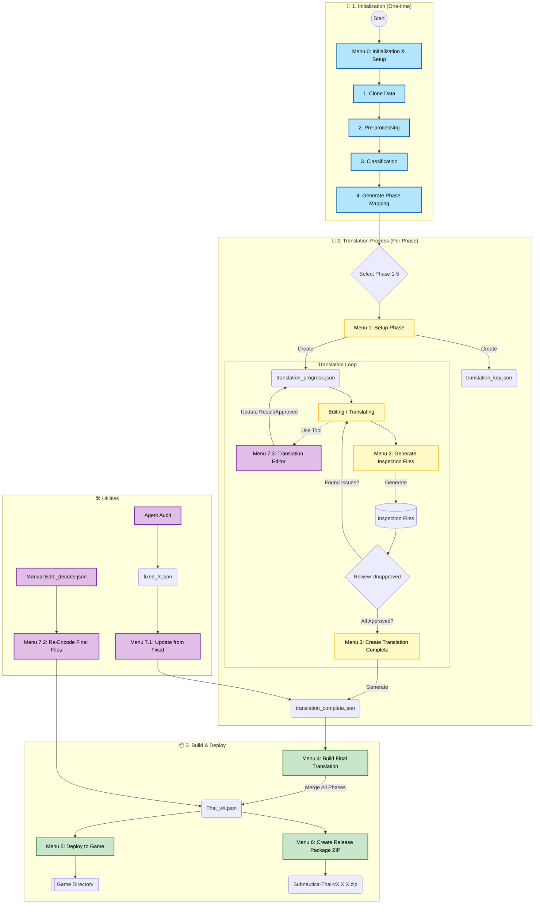

# Translation Guide (คู่มือการแปล)

เอกสารนี้รวบรวมขั้นตอนการทำงาน (Step-by-step Journey) สำหรับการแปลเกม Subnautica โดยใช้เครื่องมือในโปรเจกต์นี้ ตั้งแต่การตั้งค่าเริ่มต้น ไปจนถึงการนำไฟล์เข้าเกม

---

## 🚀 1. เริ่มต้นใช้งาน (Initialization)

ก่อนที่จะเริ่มงานแปลในแต่ละ Phase เราต้องเตรียมข้อมูลตั้งต้นให้พร้อมก่อน

1.  รันโปรแกรมหลัก:
    ```bash
    uv run main.py
    ```
2.  เลือกเมนู **`0. Initialization & Setup`**
3.  ทำตามขั้นตอนย่อยในเมนูนั้นให้ครบ:
    *   **Clone Data:** ดึงไฟล์ภาษาต้นฉบับจากเกม
    *   **Pre-processing:** เตรียมไฟล์และตรวจสอบความถูกต้อง
    *   **Classification:** จัดหมวดหมู่ข้อความ
    *   **Generate Phase Mapping:** สร้างไฟล์แบ่งงานตาม Phase

---

## 📝 2. กระบวนการแปล (Translation Process)

เมื่อเตรียมข้อมูลเสร็จแล้ว เราจะเริ่มแปลโดยแบ่งงานออกเป็น 5 Phases (เลือกทำทีละ Phase)

### ขั้นตอนการทำงาน (Workflow)

#### 1. เริ่มต้น Phase (Setup)
*   เลือกเมนู **`1. Setup Phase`** แล้วระบุเลข Phase (1-5)
*   โปรแกรมจะสร้างไฟล์สำคัญ 2 ไฟล์ในโฟลเดอร์ `data/[PHASE_NAME]/`:
    *   `translation_key.json`: เก็บ Key ทั้งหมดของ Phase นั้น (อ้างอิงจากต้นฉบับ)
    *   `translation_progress.json`: **ไฟล์หลักในการทำงาน** ใช้เก็บสถานะการแปล

#### 2. แปลภาษา (Editing)
เราจะใช้เวลาส่วนใหญ่กับไฟล์ `translation_progress.json` โดยใช้ `editor.py` หรือแก้ไฟล์ JSON โดยตรง

**การใช้งาน Editor:**

https://github.com/user-attachments/assets/e9010cb2-1cee-474c-961c-8e4252873afb

*   เลือกเมนู **`7. Utilities / Tools`** -> **`3. Open Translation Editor`**
*   หรือรันคำสั่งใน Terminal ใหม่:
    ```bash
    uv run streamlit run editor.py
    ```
*   **แก้ไขเฉพาะ field `Result` เท่านั้น**
*   **Special Tags:**
    *   `[thai]` หรือ `[THAI]`: ใช้แทนค่าจาก field `Thai` (ของเดิม)
    *   `[english]` หรือ `[ENGLISH]`: ใช้แทนค่าจาก field `English` (ต้นฉบับ)
    *   *ใช้ tag เหล่านี้เพื่อลด Human Error จากการ Copy-Paste*
*   **การ Approve:** หากประโยคไหนแปลสมบูรณ์แล้ว ให้แก้ field `Approved` เป็น `true`

#### 3. ตรวจสอบข้อมูล (Inspection)
เมื่อต้องการดูภาพรวมงาน หรือเตรียมข้อมูลสำหรับส่งต่อ (เช่น ให้คนหรือ AI รับช่วงต่อ) เพื่อจะได้ทราบว่ามีข้อความใดที่ยังไม่เสร็จบ้างหรือผ่านการ Approve แล้วบ้าง
*   เลือกเมนู **`2. Generate Inspection Files`** แล้วระบุเลข Phase
*   โปรแกรมจะสร้างไฟล์สำหรับตรวจสอบ (ห้ามแก้ไขไฟล์เหล่านี้โดยตรง):
    *   `translation_inspection.json`: ไฟล์ที่แสดงผลลัพธ์จริง (Replace Tags แล้ว)
    *   `translation_unapproved_inspection.json`: รายการข้อความที่ **ยังไม่ผ่าน** การ Approve (Pending List)
    *   `translation_approved_inspection.json`: รายการข้อความที่ **ผ่าน** การ Approve แล้ว (Reference List)

#### 4. สร้างไฟล์แปลฉบับสมบูรณ์ (Phase Complete)
เมื่อแปลครบและตรวจสอบเสร็จแล้ว
*   เลือกเมนู **`3. Create Translation Complete`** แล้วระบุเลข Phase
*   โปรแกรมจะสร้างไฟล์ `translation_complete.json` ของ Phase นั้นๆ (ดึงข้อมูลจากรายการที่ Approved แล้วเท่านั้น)

---

## 📦 3. รวมไฟล์และติดตั้ง (Build & Deploy)

เมื่อได้ไฟล์แปลครบตามต้องการแล้ว (ไม่จำเป็นต้องครบทุก Phase ก็ได้)

1.  **รวมไฟล์ (Build Final):**
    *   เลือกเมนู **`4. Build Final Translation`**
    *   โปรแกรมจะรวม `translation_complete.json` จากทุก Phase มารวมเป็นไฟล์เดียว

2.  **นำเข้าเกม (Deploy):**
    *   เลือกเมนู **`5. Deploy to Game`**
    *   โปรแกรมจะนำไฟล์ที่รวมเสร็จแล้ว ไปวางในโฟลเดอร์เกมให้ทันที (สามารถเลือก Version และ Path ได้)

3.  **สร้างแพ็คเกจสำหรับเผยแพร่ (Create Release Package):**
    *   เลือกเมนู **`6. Create Release Package (ZIP)`**
    *   สร้างไฟล์ .zip ของชุดภาษาสำหรับเผยแพร่ (สามารถระบุ Version ได้)

---

## 🛠️ 4. เครื่องมือเสริม (Utilities)

เมนู **`7. Utilities / Tools`** รวบรวมเครื่องมืออำนวยความสะดวกเพิ่มเติม:

### 1. Update Complete from Fixed (Audit Fix)
ใช้สำหรับกรณีที่มีการแก้ไขคำผิดหลังจากได้ไฟล์ Complete แล้ว (เช่น ให้ Agent Auditor ตรวจสอบ)
*   บันทึกผลการแก้ไขเป็นไฟล์ JSON (เช่น `fixed_1.json`) ไว้ใน `agent/agent_auditor/phase_[N]_review/`
*   เลือกเมนูนี้เพื่ออัปเดตข้อมูลกลับเข้าสู่ `translation_complete.json`

### 2. Re-Encode Final Files (Manual Fix)
ใช้สำหรับกรณีที่มีการแก้ไขไฟล์ `_decode.json` ในโฟลเดอร์ `final/` ด้วยมือ (เพื่อแก้คำผิดด่วน)
*   เลือกเมนูนี้เพื่อแปลงไฟล์ Decode กลับเป็นไฟล์เกม (Encoded) ให้ทันที โดยไม่ต้อง Build ใหม่ทั้งหมด

### 3. Open Translation Editor

แสดงคำสั่งสำหรับเปิดโปรแกรม Editor


---


## 📊 Workflow Diagram (แผนผังการทำงาน)

